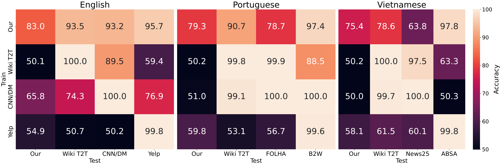

# WETBench: A Benchmark for Detecting Task-Specific Machine-Generated Text on Wikipedia

This repository is the official implementation of  __WETBench: A Benchmark for Detecting Task-Specific Machine-Generated Text on Wikipedia__.

<!-- Should be the link to the paper [My Paper Title](https://arxiv.org/abs/2030.12345) -->

---

## Abstract

TODO

---

## Requirements

### 1. Clone the Repository

```bash
TODO
git clone https://github.com/yourusername/X_NURBS.git
cd X_NURBS
```

### 2. Download Pretrained Models

We host the pre-trained models for experiment 2 on generalisability on GDrive. You can also run the models yourself with file TODO:add file here. The file below will download and unzip models to `TODO:file dir`. Download file is 18GB and unzipped is 25GB.

```bash
bash download_models.sh
```

**Note:** This script requires `gdown`. Install it via:
```bash
pip install gdown
```

---

### 3. Set Up the Python Environment

We recommend using a virtual environment to manage dependencies.

```bash
python3 -m venv venv
source venv/bin/activate
pip install --upgrade pip
pip install -r requirements.txt
export HF_HOME="" # optional to manage cache
```

---

## Main Results 

**Note:** Experiment 1 was run on either a single **NVIDIA A100 80GB** or two **NVIDIA A100 40GB**. Experiment 2 was run on a single **NVIDIA A100 80GB**. We strongly recommend to replicate results with GPUs.


### Experiment 1: Within-Task Detection


To run black-box detectors, you need provide your OpenAI key. The code below replicates results without those.

**Note:** Evaluations of zero-shot detectors take some time (probably 1 1/2 days in total). We recommend splitting scripts if using an HPC. Supervised detectors run much faster. To only run those, please only run `detect_train_hp.sh`.

```bash
export OPENAI_API_KEY=sk-... # only if you want to run black-box detectors
bash run_detection.sh
```

### Experiment 2: Generalisation

Running this populates /scratch/users/k21157437/x_neurips/generalise/data/detect of the format trainFile_2_testFile_model_language.jsonl



```bash
bash run_generalisation.sh
```

### Experiment 2: SHAP Value Analysis


Running this create shap_vals.pdf in assets.
```bash
bash run_shap_vals.sh
```

Each script will log its output to the `logs/` directory (if applicable) and write result files to the `results/` folder.

---

## Other Results

### Prompt Selection


Add ypu can also run everything without qafacteval bc this causes problems
To replicate our prompt selection evaluation, ensure the following requirements are met

1. Create a Conda env for QAFactEval

For evaluation with QAFactEval, we recommend to use Conda. Clone and install the QAFactEval to the cwd. You can follow the instructions from the corresponding repo: https://github.com/salesforce/QAFactEval. Then create a conda environment:

```bash
conda env create -f environment_qafe.yml
pip install -r requirements_qafe.txt
```

2. Download Style Classifiers

Download the style classifiers. This is the same procedure as above, so please nsure you have `gdown` installed.

```bash
bash download_sc.sh
```

3. Run the Evaluation

To run the evaluation use the following command. This runs the evaluation for Vietnamese, but you can change the parameter in the corresponding files.

```bash
bash run_prompt_eval.sh
```


---

## Data Collection

We provide all data (WikiPS, mWNC, and the MGTs) via [Hugging Face](https://huggingface.co/datasets/cs928346/WETBench) 

Below we show how to replicate our data sets.

### WikiParas

To reproduce our data collection, please follow these steps:

1. Download the latest wikidumps. Replace `${lang}` with one of `[en, pt, vi]` (or any other language if you want to extend the data)

**Note**: The English wikidump is huge (>660GB).

```bash
mkdir -p data # creates a data folder
wget -P data https://dumps.wikimedia.org/enwiki/20190120/${lang}wiki-latest-stub-meta-history.xml.gz  
gunzip data/enwiki-20190120-stub-meta-history.xml.gz
```


2. a) Get latest articles, b) query the mediawikiapi to obtain htmls, c) obtain the base sample with 

If you run other languages than ours you may want to adjust the `parse_infobox` function and others that depend specific language implementations.

**Note**: A valuable contibution would be to implement the data cleaning with the `mwparserfromhtml` (https://pypi.org/project/mwparserfromhtml/)

```bash
bash collection/1_get_latest_articles.sh
bash collection/2_query.sh
bash collection/3_get_text.sh
```

This creates the base sample `3_${lang}_text.jsonl` for each language from which `paras` and  `sums` folder draw data to create paragrpah and summarisation datasets:


```bash
bash paragraphs/data/gen_paras.sh
bash summaries/data/gen_sums.sh
```

This creates our datasets in the `paragraphs/data` and `summaries/data` directories.


### mWNC

To replicate the extension of mWNC, ensure you have downloaded the wikidumps (run 1. fom WikiParas). This extends the work by Pryziant et al. (2020), all credits to them. This below instruction run the data collection for a given language. To change that, please go the the respective files and adjust the language variable to either `[en, pt, vi]`.

1. Get all NPOV-related revisions.

```bash
bash tst/data/1_get_nrevs.sh
```

2. Crawl all diffs. We run this with multiple array jobs on an HPC, we recommend to do the same as otherwise this collection will take multiple days.

```bash
bash tst/data/2_get_crawl.sh
```

3. Process data.

```bash
bash tst/data/3_process.sh
```

4. Generate datasets for sentence-level for all languages, and paragraph-levle for English. FOr the latter, you need to run the instructions above for English, and run the paragraphs specification in `4_gends.sh`.

```bash
bash tst/data/4_gends.sh
bash tst/data/5_get_paras.sh
```


---

## Contributing

Valuable contributions inlcude:

- A valuable contibution would be to implement the data cleaning with the `mwparserfromhtml` (https://pypi.org/project/mwparserfromhtml/)
- Extending the data to other languages, including more generators, and expanding tasks